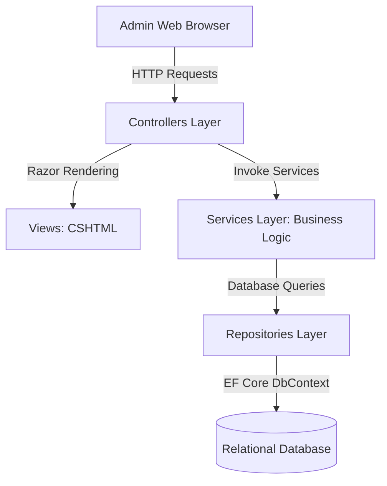

# GCI Admin Web Portal - Developer Documentation

This document provides technical developer documentation for the GCI Admin Web Application (`GCI_Admin`).

---

## 1. System Architecture & Tech Stack

The GCI Admin Web Portal is built on the **ASP.NET Core MVC** framework. It interfaces with the backend SQL database through Entity Framework Core.



### Core Technologies
- **Core Framework**: .NET 8.0 / ASP.NET Core MVC
- **Data Access**: Entity Framework Core (EF Core)
- **Database**: Relational Database (SQL Server/LocalDB/PostgreSQL)
- **Security**: Cookie Authentication & Claims-based Authorization
- **Frontend**: Razor Views, Vanilla CSS, JS/jQuery, and canvas signature rendering.

---

## 2. Dependency Injection & Configuration (`Program.cs`)

`Program.cs` serves as the application bootstrapper. It configures backend services, logging, database contexts, and HTTP middleware pipelines.

### Service Registration (DI)
Dependency injection scopes are registered in `Program.cs`. Example:
```csharp
// Registering DbContext
builder.Services.AddDbContext<ApplicationDbContext>(options =>
    options.UseSqlServer(builder.Configuration.GetConnectionString("DefaultConnection")));

// Registering Custom Services & Repositories
builder.Services.AddScoped<IAssembliesService, AssembliesService>();
builder.Services.AddScoped<IMinistriesService, MinistriesService>();
builder.Services.AddScoped<IEventService, EventService>();
builder.Services.AddScoped<IBenevolenceService, BenevolenceService>();
```

### Authentication & Authorization Pipeline
The web portal utilizes Cookie-based Authentication to establish and maintain sessions:
```csharp
builder.Services.AddAuthentication(CookieAuthenticationDefaults.AuthenticationScheme)
    .AddCookie(options =>
    {
        options.LoginPath = "/Auth/Login";
        options.LogoutPath = "/Auth/Logout";
        options.ExpireTimeSpan = TimeSpan.FromHours(2);
        options.SlidingExpiration = true;
    });
```
Actions on controllers are annotated with `[Authorize(Roles = "Administrator, Auditor")]` or custom claims-based authorization filters to prevent unauthorized routing.

---

## 3. Data & Persistence Layer (`DBOperations/`)

Entity Framework Core maps database entities to C# model classes.

- **`ApplicationDbContext.cs`**: Coordinates Entity Framework Core functionality. Maps database tables (`Assemblies`, `Members`, `Ministries`, `DeaconReports`, `BenevolenceClaims`, and `ServiceCollections`).
- **Repositories Pattern**: Used to isolate DbContext operations from the service layers. Repositories include:
  - `GECMemberRepository.cs`
  - `LeadershipRepository.cs`
- **Database Migrations**: Entity Framework Core migrations are stored in `DBOperations/Migrations/` to track schema changes.

---

## 4. Core Services & Repositories Logic & Operations

The GCI Admin Web Portal operates on a strict Service-Repository abstraction pattern. Business logic, transactions, validations, and mapping reside in the **Service** layer, while raw EF Core database transactions, entity queries, and eager loading operations reside in the **Repository** layer.

### 4.1. Authentication & Security
- **`AuthService.cs` & `AuthRepository.cs`**:
  - **Logic & Operations**:
    - Validates admin login credentials using secure hash comparisons.
    - Generates user session claims (such as `Name`, `Email`, and custom `RoleId` claims) to write to the browser's encrypted cookie container.
    - Handles account recovery tokens validation and secure password updates.

### 4.2. Assemblies & Church Structure
- **`AssembliesService.cs` & `AssembliesRepository.cs`**:
  - **Logic & Operations**:
    - Performs validation checks on assemblies DTOs before persistence (e.g. verifying coordinates formatting and avoiding duplicate names).
    - Links and unlinks leaders (Pastors and Deacons) to assemblies, updating relational foreign keys.
    - Toggles assembly operational statuses (Active/Inactive), which dynamically reflects on the mobile client registry.

### 4.3. Members Directory
- **`MembersService.cs` & `MembersRepository.cs`**:
  - **Logic & Operations**:
    - Manages member records, filtering search queries against large databases (by assembly, age group, or ministry).
    - Coordinates profile updates and processes account deletion requests (compliance workflows to wipe personally identifiable data).

### 4.4. Ministries & Assignments
- **`MinistriesService.cs` & `MinistriesRepository.cs`**:
  - **Logic & Operations**:
    - Administers ministry lists and manages ministry leader placements.
    - Resolves queries to fetch active leaders and assigns department heads, validating that a member has valid credentials before making them a ministry supervisor.

### 4.5. Events Management
- **`EventsService.cs` & `EventsRepository.cs`**:
  - **Logic & Operations**:
    - Coordinates event calendar records, validates booking allocations, and links registrations with payments.
    - Intercepts event feedback submissions, analyzing scores and reviews compiled by members.

### 4.6. Benevolence Claims Reviews
- **`BenevolenceService.cs` & `BenevolenceRepository.cs`**:
  - **Logic & Operations**:
    - Fetches benevolence cover requests, eager-loading beneficiary details and uploaded certification paths.
    - Implements the state machine for claims progression (`Pending` -> `Under Review` -> `Approved` -> `Disbursed`).
    - Enforces audit trail notes inputs and triggers automatic FCM notifications when a claim state shifts.

### 4.7. Finance & Service Collections Auditing
- **`ReportsService.cs`, `PaymentsService.cs` & `ReportsRepository.cs`**:
  - **Logic & Operations**:
    - Fetches weekly deacons reports, mapping observation fields and exposing pastoral care flags.
    - Retrieves service collections reports. Converts base64-encoded signature streams to display on auditing views.
    - Implements auditing checks: once verified by the auditor, it executes database updates to seal the collection, preventing further modifications by deacons.

### 4.8. System Configurations
- **`SystemConfigService.cs` & `SystemConfigRepository.cs`**:
  - **Logic & Operations**:
    - Reads and caches configuration metadata from the database.
    - Provides APIs to update dynamic configs like payments channels, system maintenance toggles, and notification settings.

---

## 5. Development Setup & Launch Instructions

### Setup Local Database Configuration
1. Open the [appsettings.json](file:///C:/Users/USER/Projects/GCI/GCI_Portal/GCI_Admin/appsettings.json) configuration file.
2. Update the `ConnectionStrings:DefaultConnection` to match your local SQL Server environment.

### Run & Build Commands

- **Restore NuGet Packages**:
  ```powershell
  dotnet restore
  ```
- **Apply Database Migrations**:
  ```powershell
  dotnet ef database update
  ```
- **Run the Application**:
  ```powershell
  dotnet run --project GCI_Admin
  ```
- **Build Release Publication Bundle**:
  ```powershell
  dotnet publish -c Release -o ./publish
  ```
